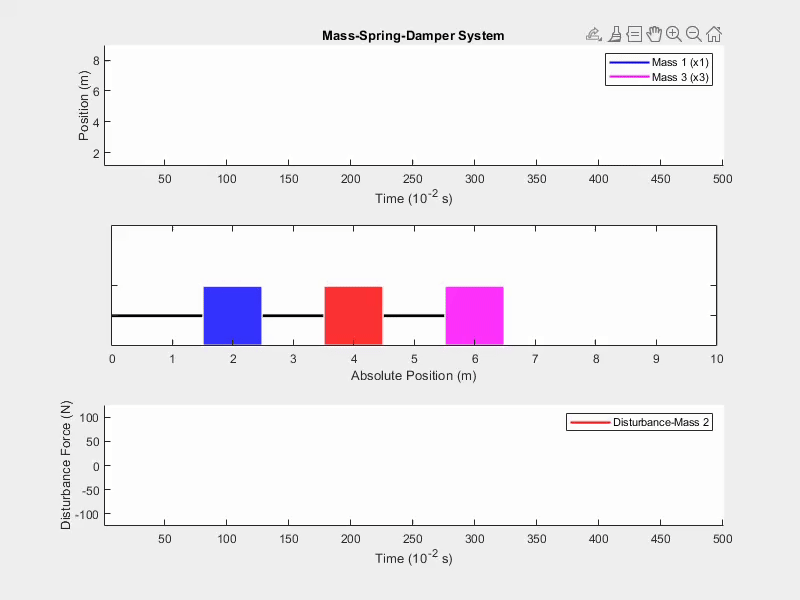

# Mass-Spring-Damper System with Physics Informed Neural Networks



## Project Overview

This project implements a Physics Informed Neural Network (PINN) to model and simulate a nonlinear Multiple-Input-Multiple-Output (MIMO) mass-spring-damper system. The implementation is being developed in MATLAB and is currently in early development stages.

## System Description

The system consists of three identical point masses ($m$ = 0.5 kg each) connected by nonlinear springs with three dampers (damping constant $d$ = 0.25 N·s/m each). The system has the following characteristics:

- Nonlinear spring stiffness: $F(x) = kΔx + kₚΔx^3$ where $k$ = 217 N/m and $k_p$ = 63.5 N/m³

- Control inputs: $u_1$ and $u_3$ applied to the first and third masses

- External disturbances: Represented as $dist$ in the system

- Output states: $x_1$ and $x_3$ positions (denoted as $y_{ctr}$) which need to be controlled

The system dynamics are governed by the following coupled nonlinear differential equations:

```math
\begin{alignat}{1}
m\ddot{x}_1 &= k(-2x_1 + x_2) + k_p[-(x_1)^3 + (x_2 - x_1)^3] + d(\dot{x}_2 - 2\dot{x}_1) + u_1 \\
m\ddot{x}_2 &= k(x_1 - 2x_2 + x_3) + k_p[(x_3 - x_2)^3 - (x_2 - x_1)^3] + d(\dot{x}_1 - 2\dot{x}_2) + \text{dist} \\
m\ddot{x}_3 &= k(x_2 - x_3) + k_p(x_2 - x_3)^3 + d(\dot{x}_2 - \dot{x}_3) + u_3
\end{alignat}
```

## Physics Informed Neural Networks Approach

This project uses Physics Informed Neural Networks (PINNs) to solve and predict the behavior of this nonlinear system. The PINN incorporates the physical laws directly into the neural network training process by:

- Encoding the nonlinear differential equations as part of the loss function

- Enforcing the physical constraints of the system

#### Force Equations
```math
\begin{align}
f_1 &= k(-2x_1 + x_2) + k_p(-x_1^3 + (x_2-x_1)^3) \\
f_2 &= k(x_1 - 2x_2 + x_3) + k_p((x_3-x_2)^3 - (x_2-x_1)^3) \\
f_3 &= k(x_2 - x_3) + k_p(-(x_3-x_2)^3)
\end{align}
````

#### Acceleration Equations
```math
\begin{align}
\ddot{x}_1 &= \frac{f_1}{m} \\
\ddot{x}_2 &= \frac{f_2}{m} \\
\ddot{x}_3 &= \frac{f_3}{m}
\end{align}
```

#### Physics Loss Components
```math
\begin{align}
E_{loss} &= |E_{pred} - W_{damping}| \\
W_{damping} &= d \sum \dot{x}^2 \Delta t \\
L_{Newton} &= |\ddot{x}_1|^2 + |\ddot{x}_2|^2 + |\ddot{x}_3|^2 \\
L_{physics} &= E_{loss} + 0.1 \cdot L_{Newton}
\end{align}
```

## Current Status

This project is currently in early development. Additional features and documentation will be added as the project progresses.

#### Random Sampling of Test Results

|  |  |
|----|----|
|  |  |

### Neural Network Training Results

This repository contains training results for the physics-informed neural network model.

### Training Summary

- **Total Training Time**: 11:38:43
- **GPU Memory Used**: 1.53 GB (NVIDIA GeForce RTX 3070)
- **Best Validation Loss**: 1.418526 (at iteration 680)
- **Early Stopping**: Applied with patience of 20

#### Training Loss Progression

The graph below shows the total loss and its components (prediction loss and physics loss) throughout training:


The total loss combines prediction loss (weight 2.0) and physics loss (weight increasing from 0.1 to 3.0).

__*Validation Performance:*__ Validation loss was measured at regular intervals. The best model was saved at iteration 680

__*Hyperparameter Progression:*__ The physics loss weight (λ) was gradually increased during training, while learning rate was decreased twice:

#### Key Observations

- Best validation performance was achieved early in training, suggesting possible decent generalization and fitting
- The physics loss weight (λ) increased from 0.24 to 3.0 throughout training
- Learning rate decreased from 0.001 to 0.000002 over the course of training
- Training balanced prediction accuracy with physics-based constraints

## Contact

For questions or feedback, please open an issue on GitHub or contact alvin.sutandar@gmail.com
